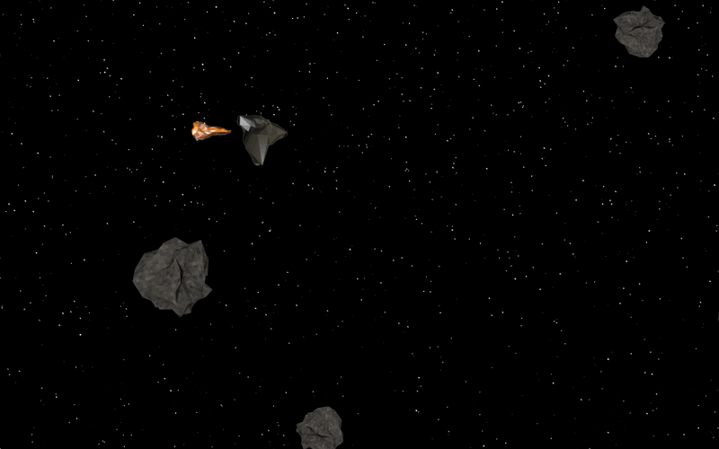
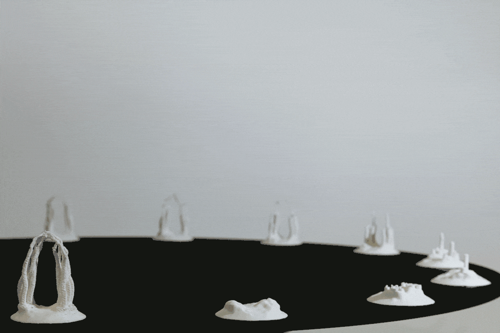

## Bacterial Photography

## Asimov
Simple spaceship game in Processing experimenting with physics in code using gravitational attraction.

## Kuitu
The cotton industry is the second largest polluter, destroying land as well as human lives. There is an awareness of our destructive lifestyle, yet we are hesitant to give it up.
What if because of emerging technology there is no need for cotton production anymore? We imagine a future, where cotton is no longer needed due to new production methods and source materials. Where fibers are produced from and consist of bacteria and have properties we are used to and wish for.
This fiber may be able to grow together - self healing - and have properties like strong stretchability and the ability to respond to environmental influences. Because this fiber is alive, it adapts to our body. Changing with it in a symbiosis, nourishing from our sweat and dead skin cells and in return protecting our body from the environment.
This may change our relationship with clothing and our behavior as a consumer, possibly reducing consumption to a point, where we begin to shift away from consumer society as we know and live it today.

