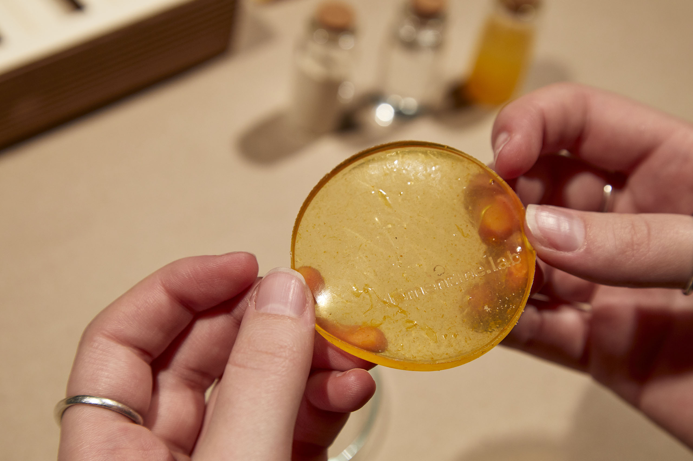
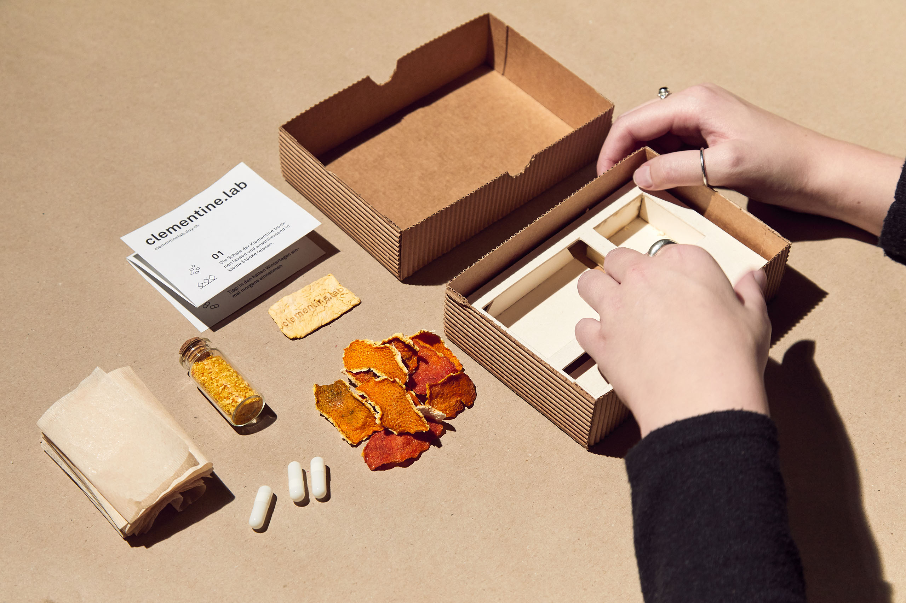
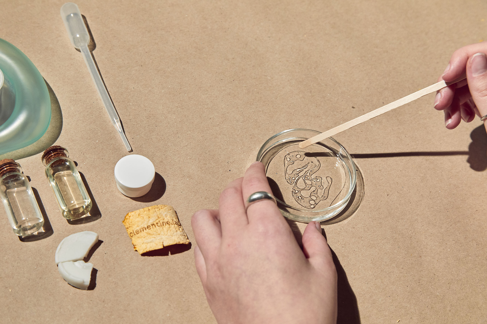
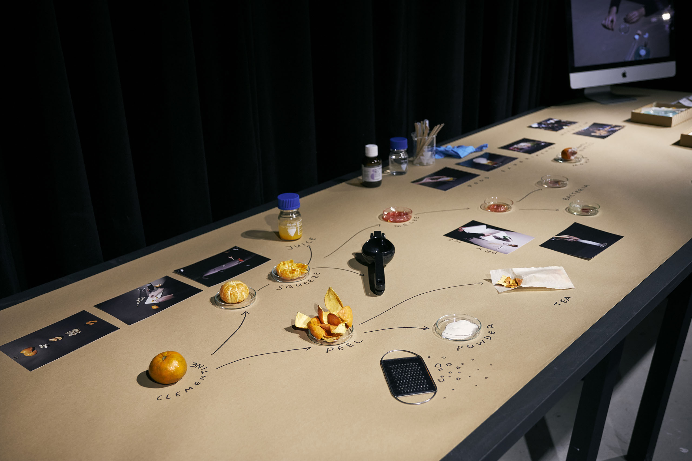
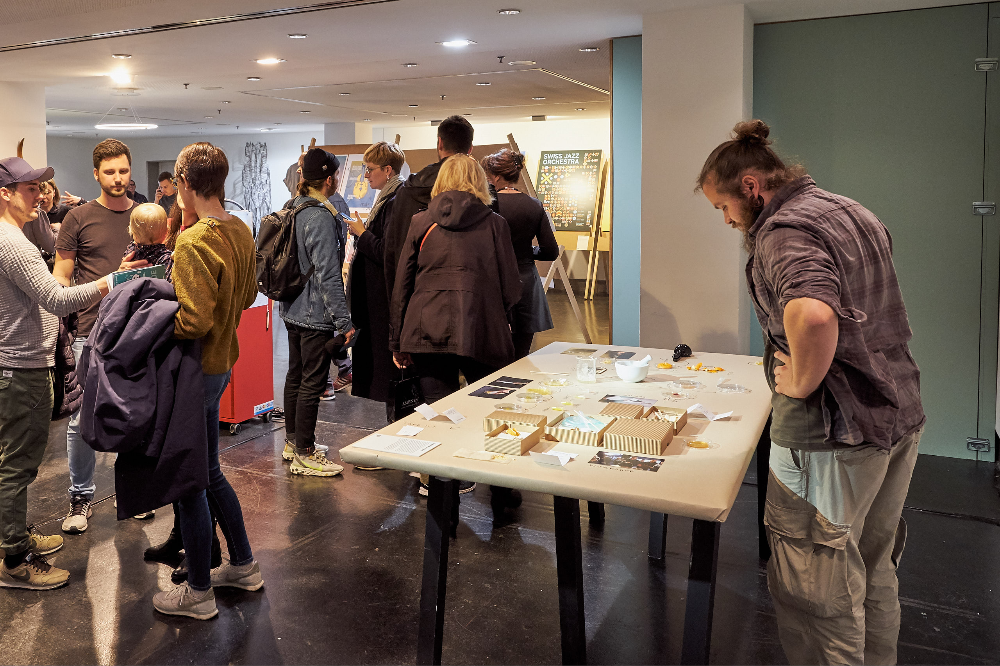
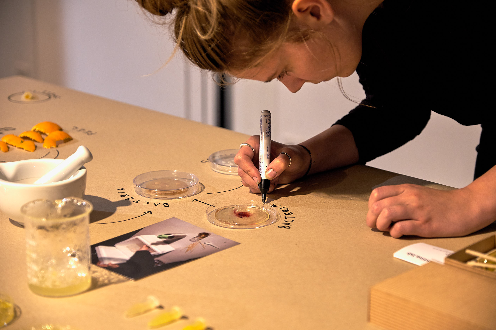
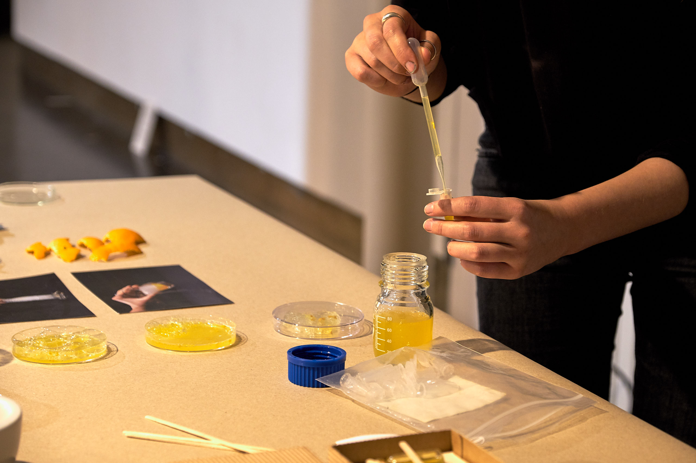
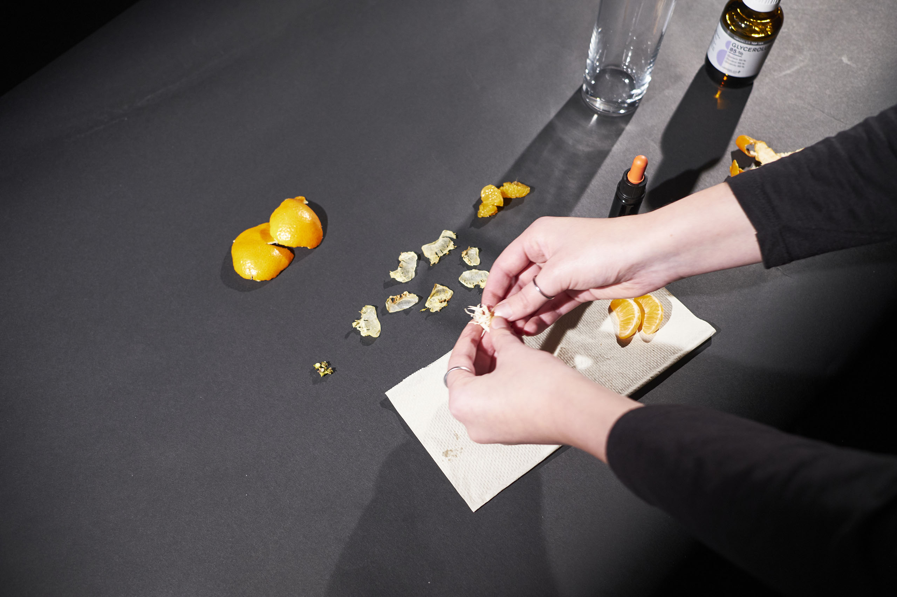
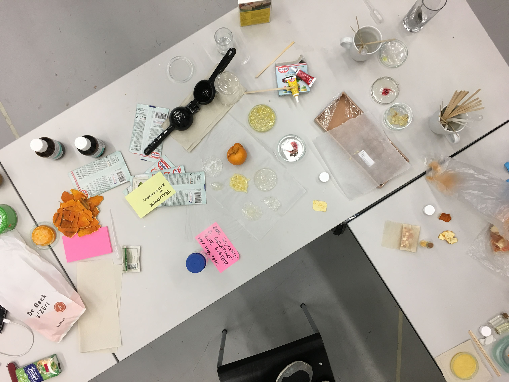
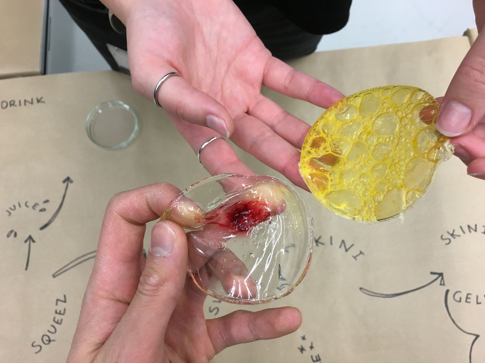

<iframe src="https://player.vimeo.com/video/407826074?color=ff0000&title=0&byline=0&portrait=0" style="position:absolute;top:0;left:0;width:100%;height:100%;" frameborder="0" allow="autoplay; fullscreen" allowfullscreen></iframe>

Clementines and other citrus fruits have a proven influence on enzyme and drug metabolism activity. clementine.lab acknowledges the potential of clementines as drugs and explores their values for DIY medicine, questioning our relationship with pharmaceuticals and our understanding of our own body. It aims at repurposing leftover clementines and discarded clementine peels and is an open source medicine platform, that distributes clementine.kits as a starting point for your first DIY medicine. It provides no recipes but a frame, to encourage and empower your experimentations with the ingredients. The clementine.lab platform provides a place where you can explore recipes from and contribute to the community by sharing the recipes you developed.

Exhibited at Punkt ZHdK 21 – 24 April 2019 and Designfestival Bern 2 - 5 May 2019

## Materials
- Clementine
- Dry Ice
- Glycerin
- Gelatine
- Soap
- Ferrofluid
- Magnets

## Exhibited
- Designfestival Bern, Switzerland  2–5 May 2019
- Punkt ZHdK Zurich, Switzerland 21–24 April 2019

## Literature
- Theile, D., Hohmann, N., Kiemel, D., Gattuso, G., Barreca, D., Mikus, G., Haefeli, WE., Schwenger, V., Weiss, J. (2016). Clementine juice has the potential for drug interactions – In vitro comparison with grapefruit and mandarin juice. European journal of pharmaceutical sciences: official journal of the European Federation for Pharmaceutical Sciences (97).
- Codoñer-Franch, P., López-Jaén, A., Muñiz, P., Sentandreu, E., Valls Bellés, V. (2008). Mandarin Juice Improves the Antioxidant Status of Hypercholesterolemic Children. Journal of Pediatric Gastroenterology and Nutrition 47(3). Kuznetsov, S., Doonan, C., Wilson, N., Mohan, S., Hudson, S., Paulos, E. (2015). DIYbio Things: Open Source Biology Tools as Platforms for Hybrid Knowledge Production and Scientific Participation.
