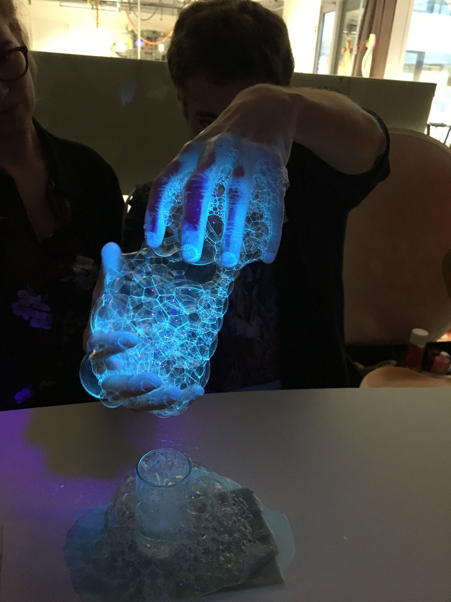
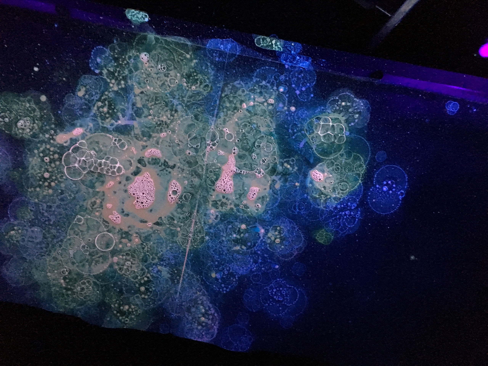

<iframe src="https://player.vimeo.com/video/407827158?color=ff0000&title=0&byline=0&portrait=0" style="position:absolute;top:0;left:0;width:100%;height:100%;" frameborder="0" allow="autoplay; fullscreen" allowfullscreen></iframe>

The material turn shifts the focus back to the materials and plays in the hand of design. Materials  as inherently performative mediators enable new forms of interactions between humans and materials, affording our actions and shifting our attitude towards how we perceive them.
We imagined how these materials would interact with each other in absence of humans, questioning the nature of identity and agency, artificial and natural. Through the short film _Flux_ we imagined an environment in which fictional active materials react and perform with each other, make decisions and develop an identity of their own. Filmed only using UV light.

