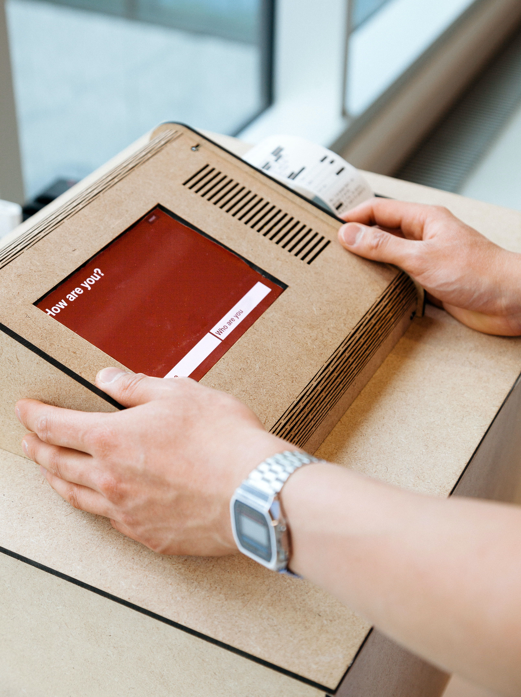
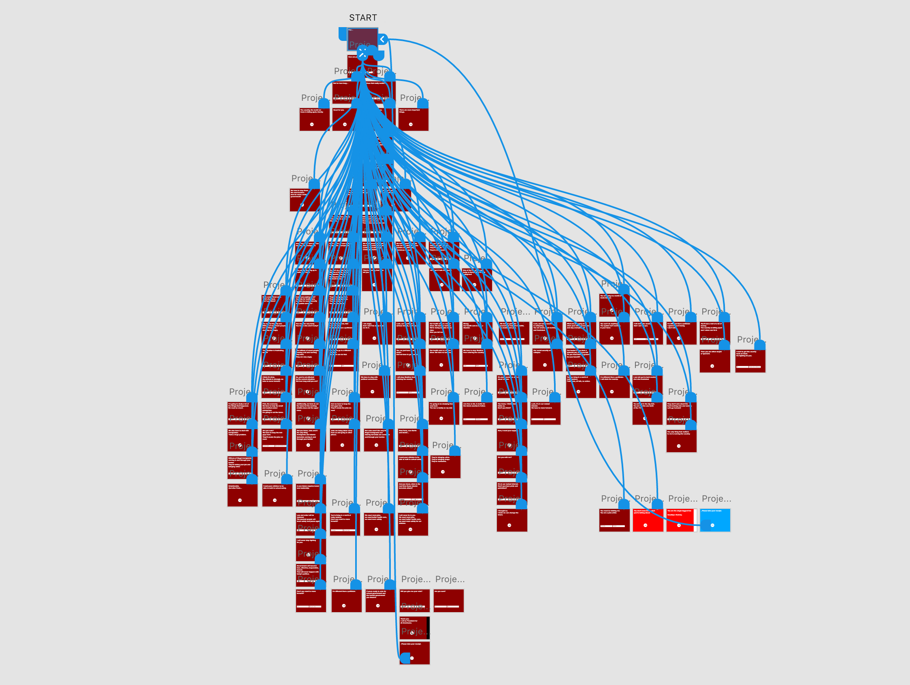

In this 2016 election the extent of data exploitation has been distinctly visible. Through data collection of social media sites such as Facebook and Twitter personalised advertisement and news are creating a digital bubble in which users find themselves.
I Always Win is an installation that confronts the user unknowingly with quotes from Donald Trump's campaign speeches and interviews. It gives the user two two answers to choose from and leads them on different paths based on their choices. At the end, the user is requested to give his vote or decline and gets a receipt for which ever decision they made.

## Material
- iPad
- Receipt printer
- Arduino
- Light sensor
- MDF
