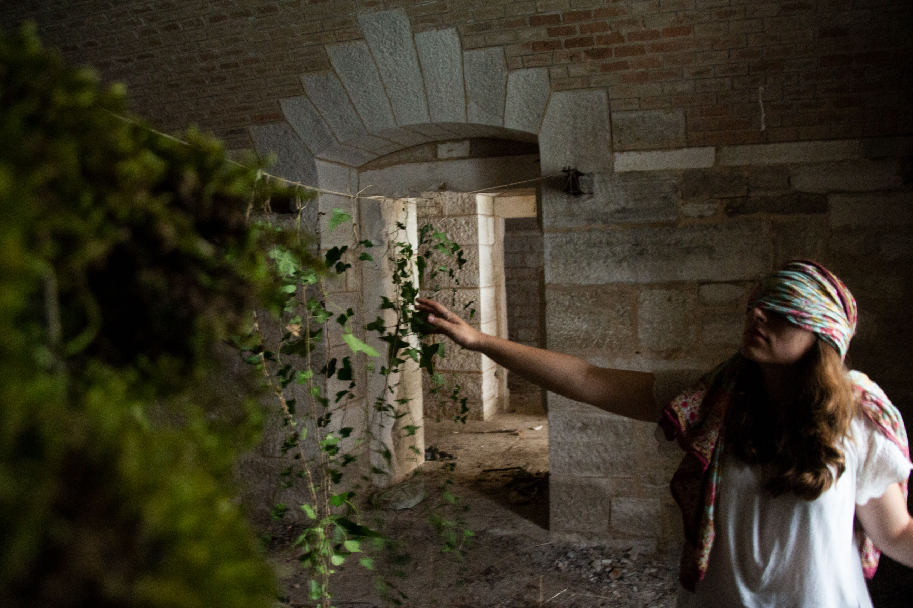
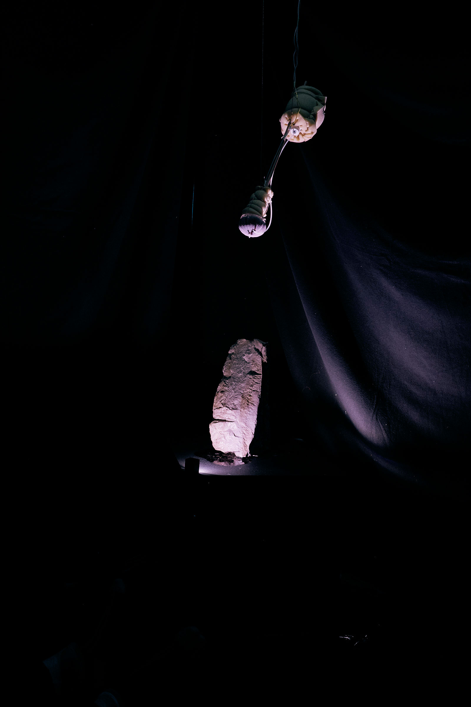
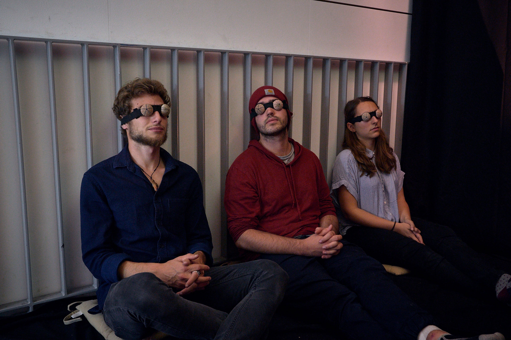
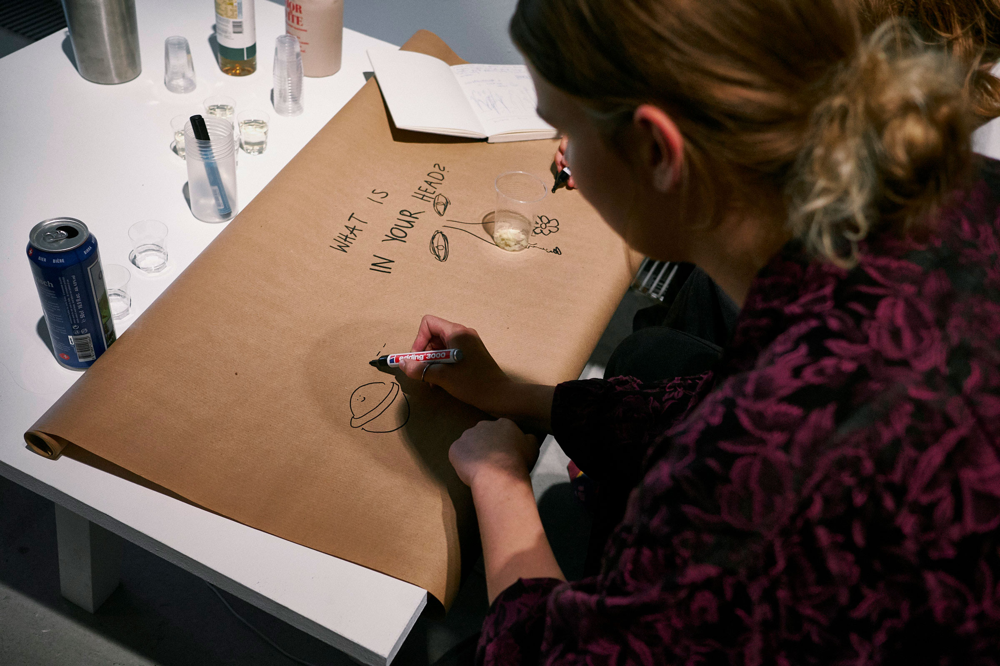

> “Räume werden im Handeln geschaffen, indem Objekte und Menschen synthetisiert und relational angeordnet werden (…) Räume entwicklen demnach eine eigenen Potentialität, die Gefühle beeinflussen kann. Diese Potentialität der Räume werde ich im folgenden ‘Atmosphäre’ nennen.” Martina Löw, 2001

How does space emerge? How do we perceive space? Spaces are processual. Spaces are fabricated. Spaces have an agency of their own. _In Your Head_ is an immersive installation challenging your senses and imagination, inviting you to build and explore spaces together - collectively dreaming space.

How do we create atmosphere and mediate space through various materials, smells and audio? Different artefacts from Pula, Croatia, perform and stimulate the blindfolded participants, playing with the notion of co-creation. The installation is located on a staircase, covered with dark curtains and pillows. A limestone artefact is displayed with an electromagnetic valve dripping decalcifier out of a sea urchin skeleton on the stone. It produces a burning smell and a distinct sound. The railing conducts sound to participants leaning on it via bone conduction using an exciter. The scents, vaporised from above, further enhance the experience, creating a space everyone perceives differently and experiences very personally. Three participants are invited each time for four minutes. At the end of the four minutes, the participants are invited to write and sketch down their experiences, discuss and share them with us and with each other, building their imagination on top of the worlds their predecessors imagined.

## Materials
- Limestone
- Decalcifier
- Sea urchin skeletons
- Arduino
- Exciter
- Vaporiser
- Self-extracted scents
