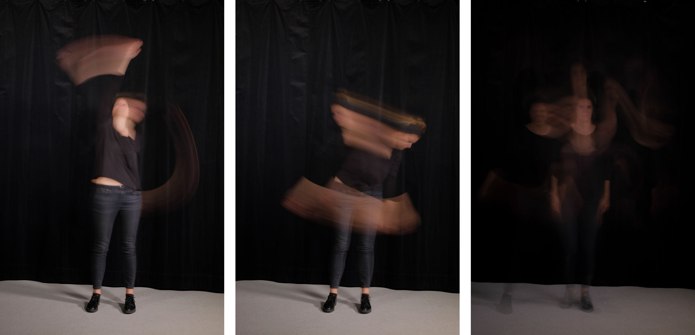
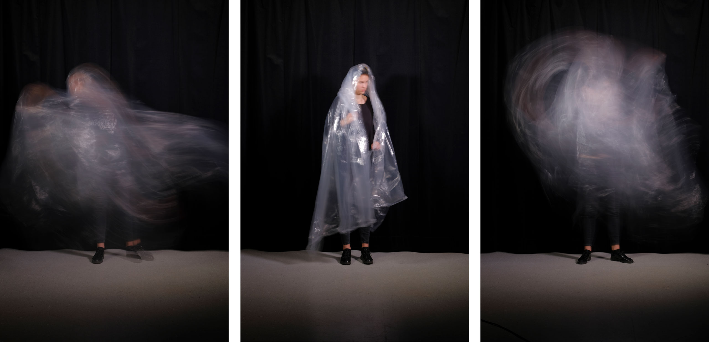
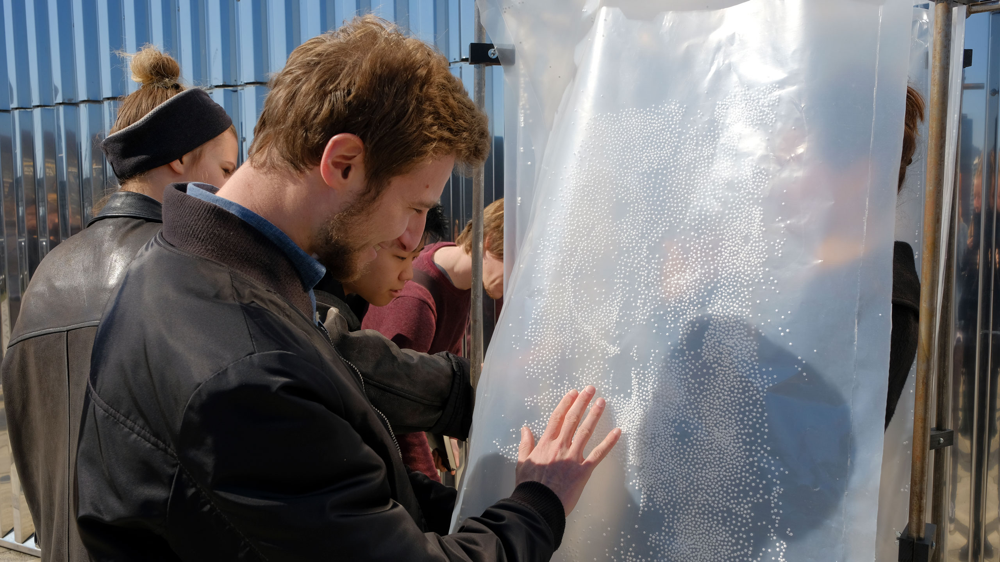

<iframe src="https://player.vimeo.com/video/407462767?color=ff0000&title=0&byline=0&portrait=0" style="position:absolute;top:0;left:0;width:100%;height:100%;" frameborder="0" allow="autoplay; fullscreen" allowfullscreen></iframe>

We worked with different aspects such as information processing, creation and communication of knowledge, visualisation of the invisible and the uncanny field of electrostatics.
We asked ourselves how we perceive the space around us and how we perceive our own space. Our focus lied on the phenomena of our body's electrostatic field. How does this field look like? How strong is it and how does it vary from person to person? How can we make this field perceivable and tangible?
We conducted several experiments to translate and convey human spaces through materials. Based on our insight, we developed a communicative surface, that reacts and acts upon our electrostatic field.

Different sizes of styrofoam spheres are placed between two sheets of a specific synthetic film, which is then fused together creating a partial vaccum. This vacuum creates more friction between the spheres and the synthetic film, holding them vertically in place and preventing them from falling to the bottom. This surface can be charged with different materials, which in turn gives the surface distinct properties, like force of the electric charge and repelling or attractive qualities, as well as different interactions between the differently sized spheres.
The surface interacts and communicates with us, by letting us feel the interaction between our electrostatic field and the surface as well as hear the electric discharges and see the movement of the spheres.

## Materials
- Plastic Sheets
- Styrofoam balls in different sizes
- Leather and synthetic fabric
- Steel frame

With Joëlle Bitton, Verena Ziegler, Joël Gähwiler
