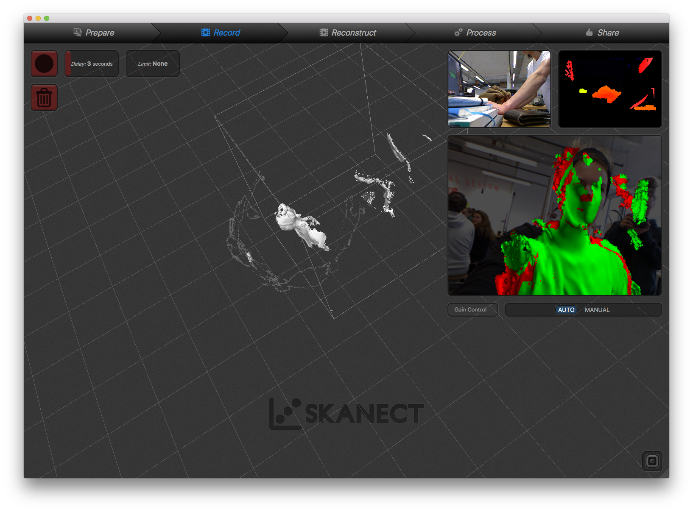

<iframe src="https://player.vimeo.com/video/407462767?color=ff0000&title=0&byline=0&portrait=0" style="position:absolute;top:0;left:0;width:100%;height:100%;" frameborder="0" allow="autoplay; fullscreen" allowfullscreen></iframe>

How do we perceive the space around us and how do we perceive our own space? How does our body's electrostatic field look like? How strong is it and how does it vary from person to person? How can we make this field perceivable and tangible?

