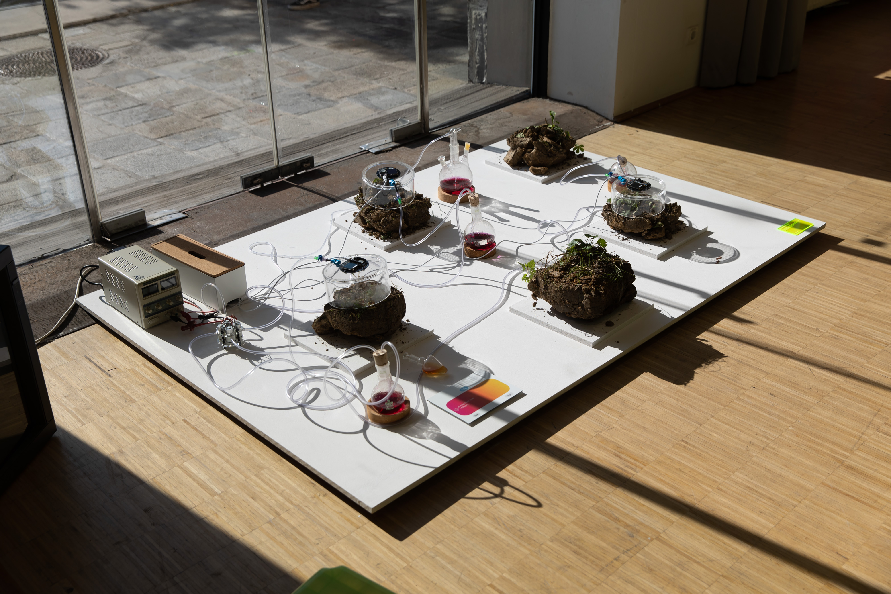

Soil flows. It is a changing body, flowing through and with everything on this planet. 
on souls and soil investigates landscapes of colonialism, capitalism and displacement in Southeast Asia and sheds light on soil’s entanglements with history, culture, politics and science. Looking at villages in Hong Kong and Cambodia, stories of social and environmental inequality and degradation are told. How might insurrectionary acts and cultivation of shared responsibility dare us to imagine otherwise?
With an attunement to the more-than-human we gain a greater sense of our interactions with terrestrial dynamics. To let these inform us is to illustrate other possibilities of life and collaborative survival.
 
 
 
BA Thesis project
 
Mentors: Dr. Roman Kirschner, Mona Neubauer, Luke Franzke
 
In collaboration with the Swiss Federal Institute for Forest, Snow and Landscape Research WSL.
 
With thanks to Empa.