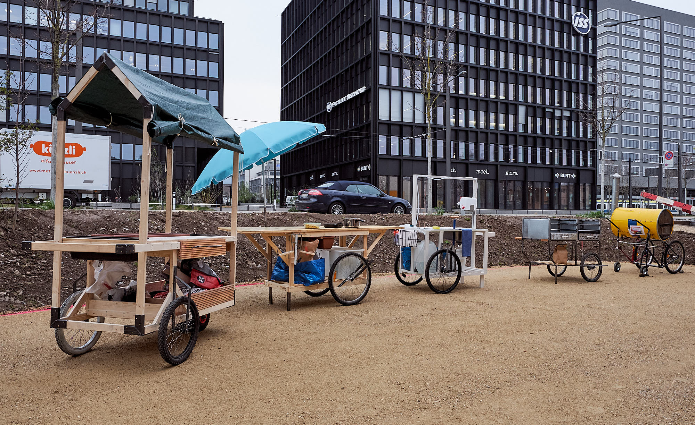
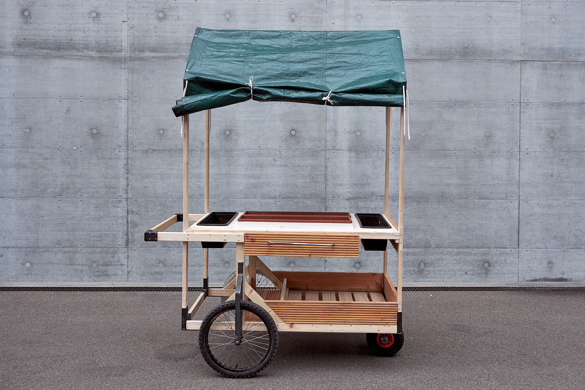
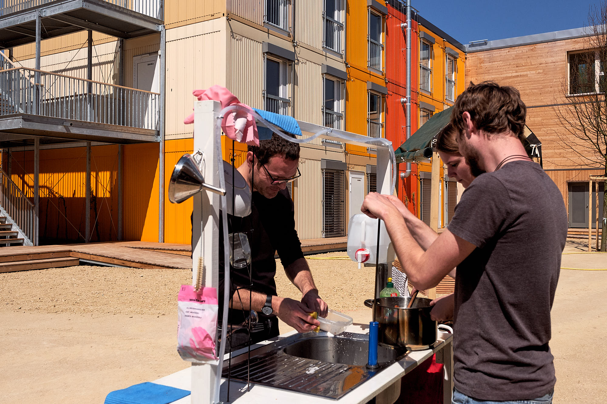
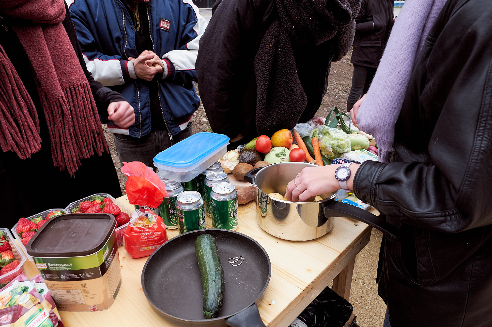
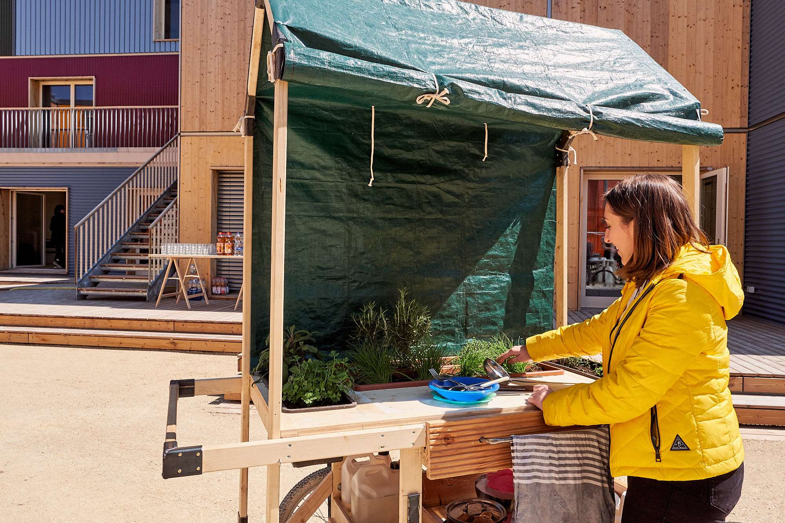
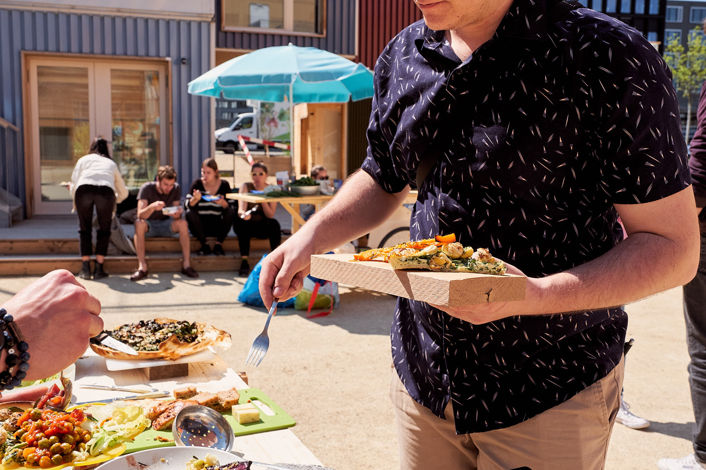

In a team of 17 designer we developed and built a mobile pop-up kitchen that could be used wherever it is needed. Together with Lukas Näf and Luana Wiskemann we built a mobile garden and fermentation cart, complementing the oven, grill, sink and preparation cart.
We collected leftover food from various markets and shops and prepared a cooking event at FOGO Zurich with the aim to invite and activate the new established community there.

First fired up at FOGO Zurich April 2019.

## Materials
- Leftover materials
- Bicycle parts
- Roof batten
- Tarp
- Custom steel connection pieces
- Flower Pots
- Leftover food from various markets
