

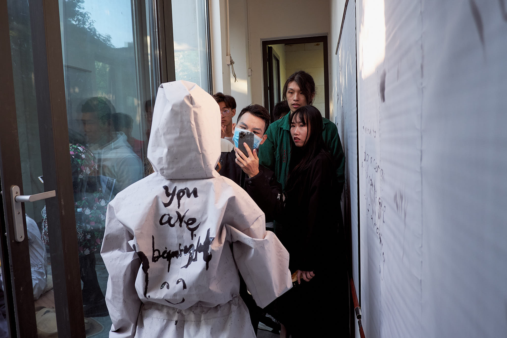

BouDai12 is an international collective that formed in October 2019 in Hong Kong.
We received the opportunity to display at the McaM in Shanghai and developed a series of installations in Hong Kong for this exhibition.

_Tear Up / See You Again_ are of photographic, video, sound and performance works that examine and reflect the construction of intricate bonds build by humans. Exploring our own roles as artists and the role of art itself, we aim to share our feelings to the audience and show our main drive behind our work: love.

- Exhibited at McaM Shanghai 9 – 24 November 2019
- Photos by Livia Benz, Duy Bui

## See You Again
Three live stream compositions taken over a timespan of two weeks during November 2019 in Shanghai, Hong Kong, Japan and Indonesia.

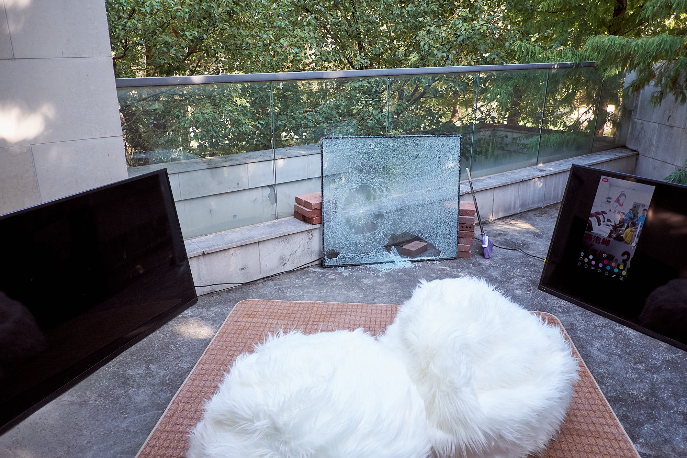
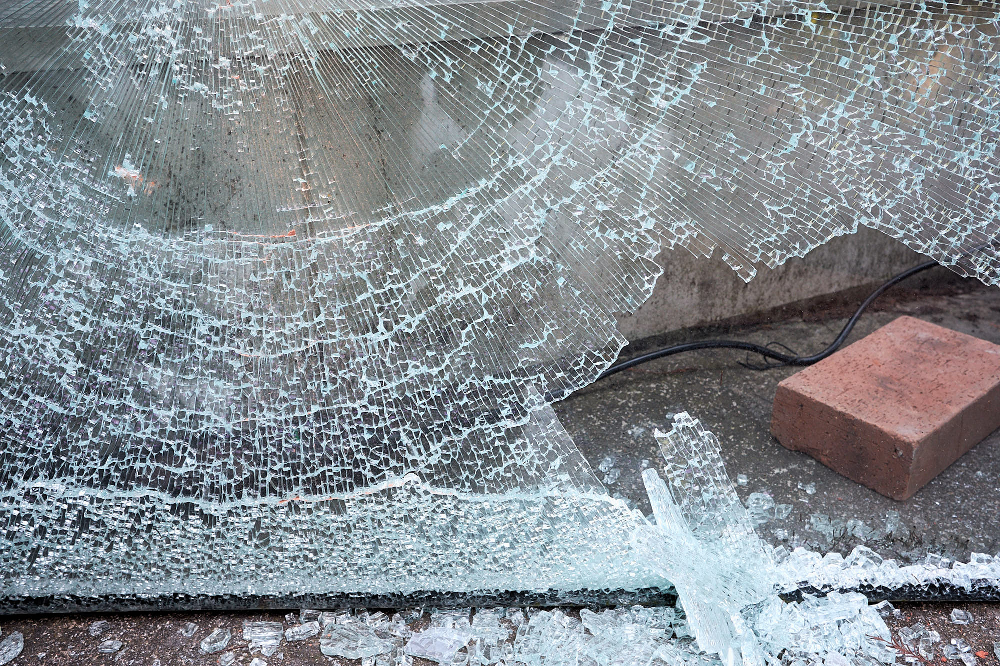

## Wheat pasted photographs
Two prints 1065x710mm and three prints 532x354mm, inkjet on poster paper, applied to the wall using wheat paste and white paint. Analog photos taken in Hong Kong during October 2019. The film was x-rayed several times during transportation to Shanghai before developing and printing.

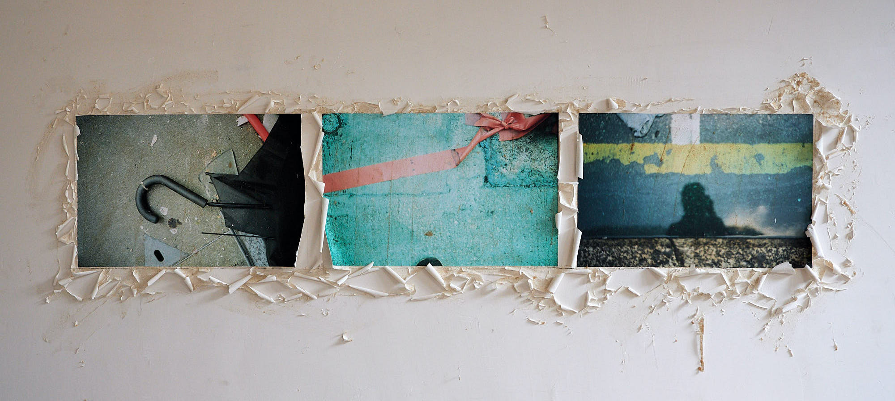
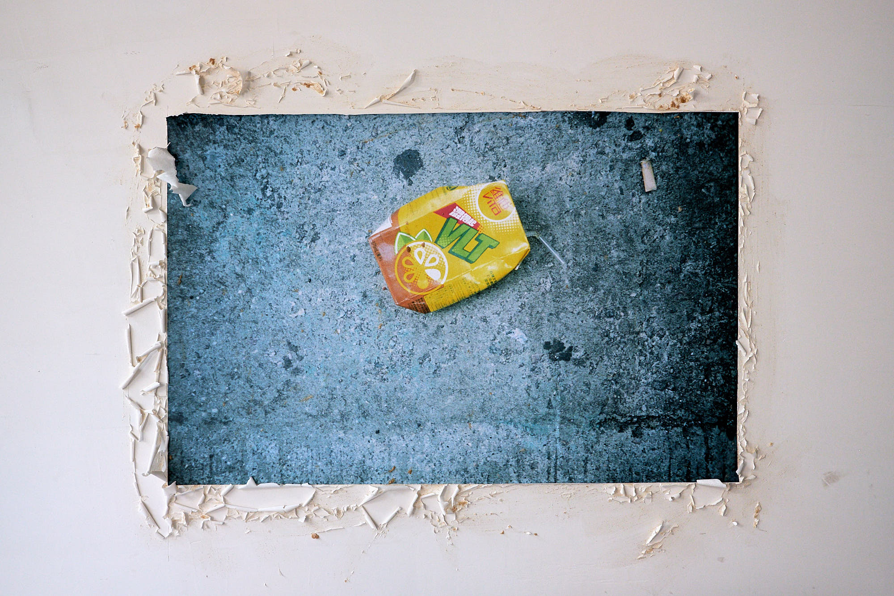
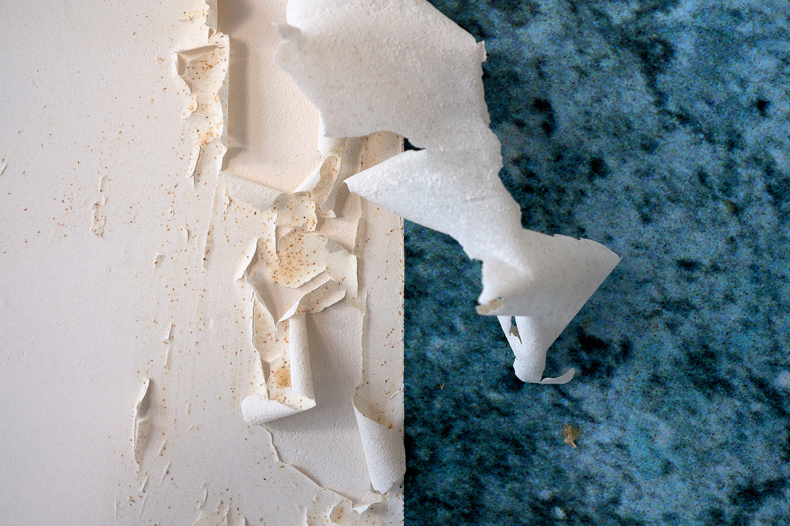
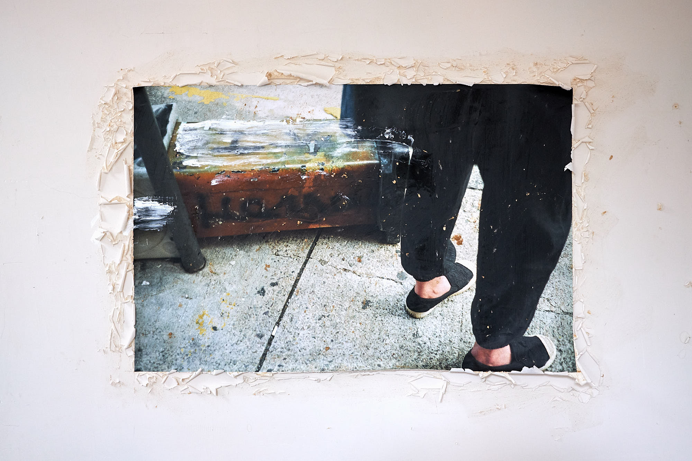
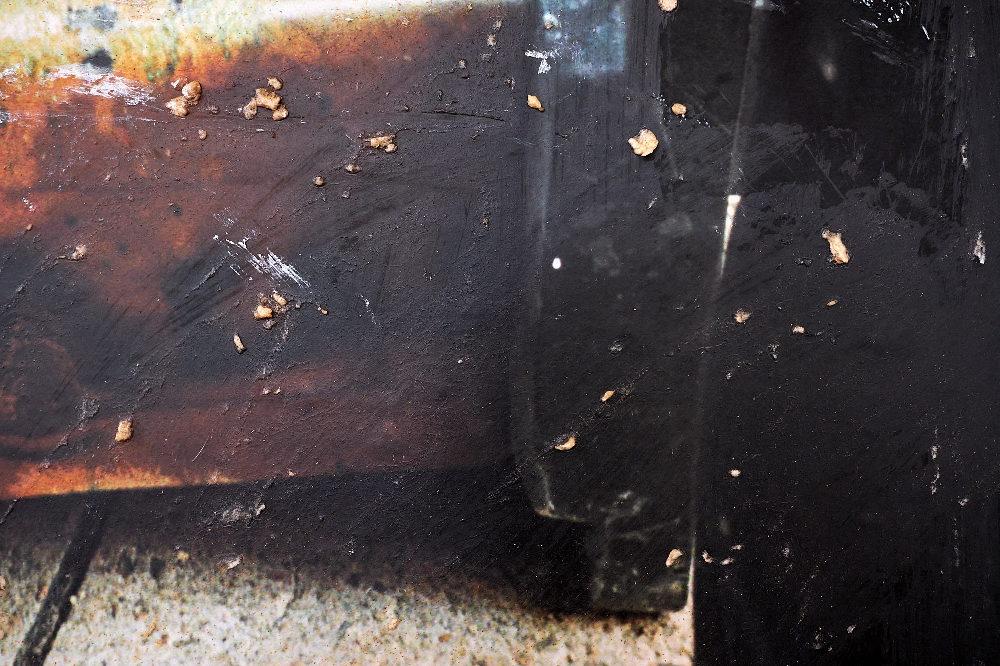

## Photo fishing line
Six black and white high-speed negatives installed floating in the air. The film was sent from Hong Kong to Shanghai and was x-rayed multiple times during transport.

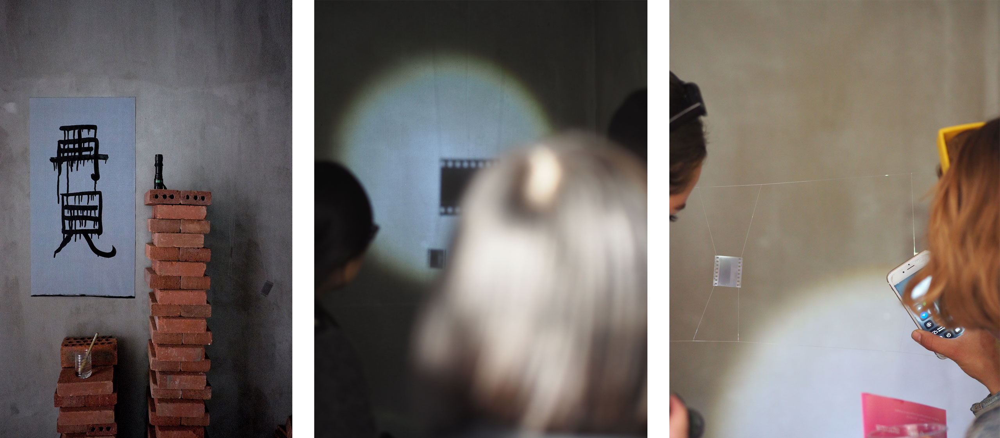

## Magic Paper Performance
Chinese Magic Paper, 6x1.5m. Four overalls made out of Chinese Magic Paper. Performance with personal expressions and quotes from Interviews taken during September through November 2019 in Hong Kong.

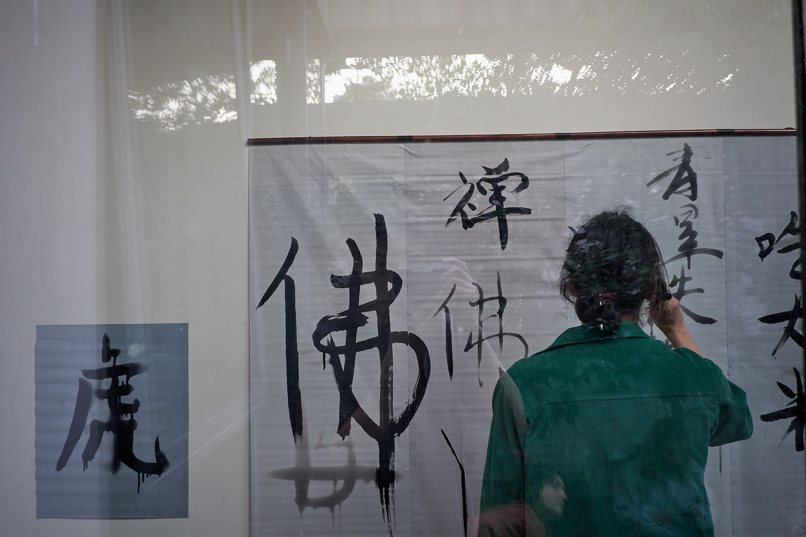
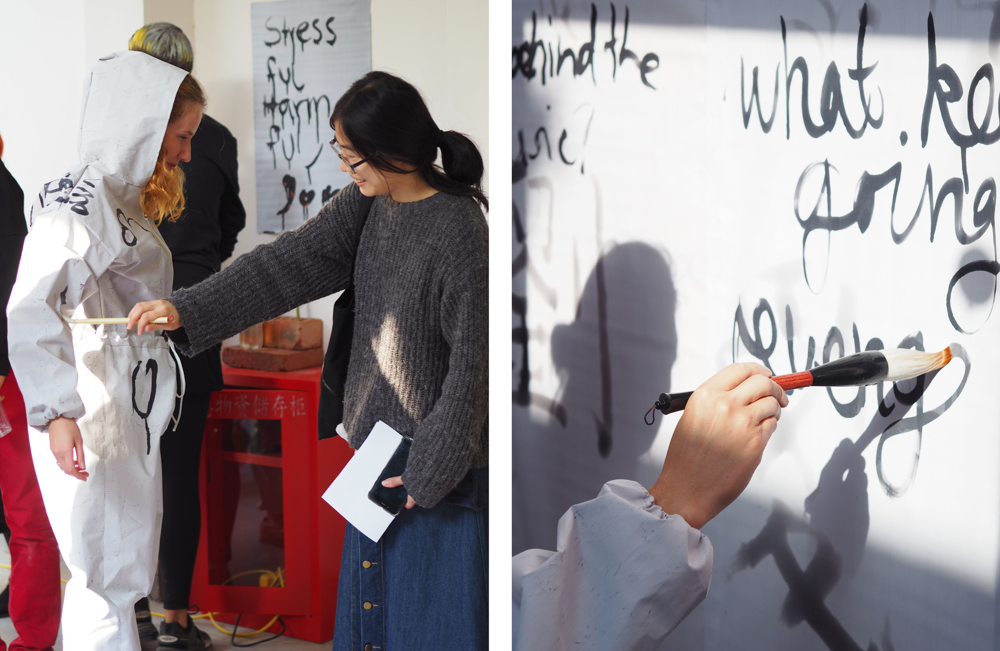

## Cockroach & Tea 

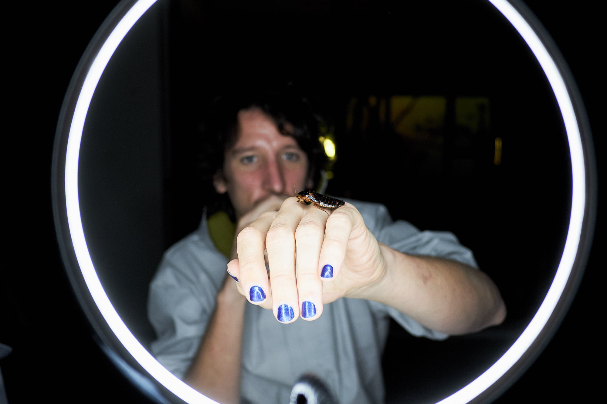
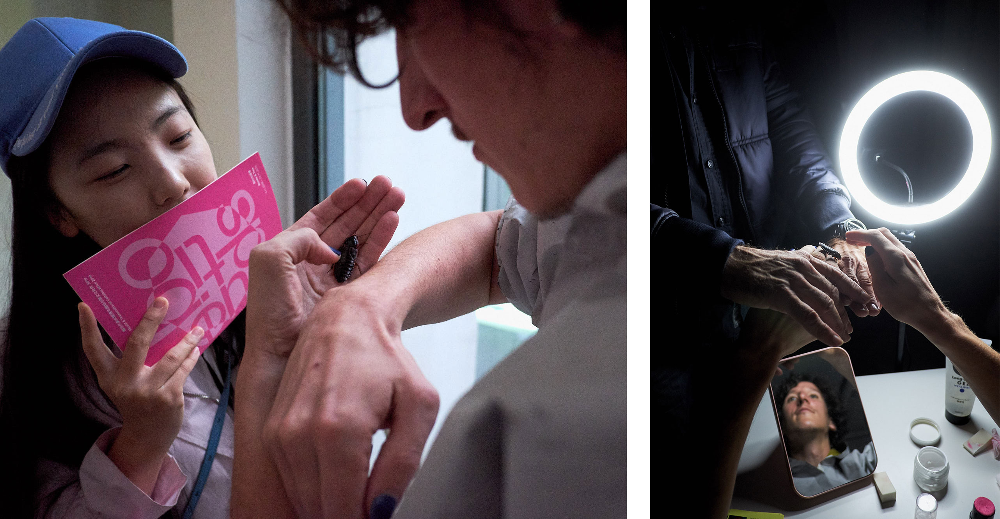
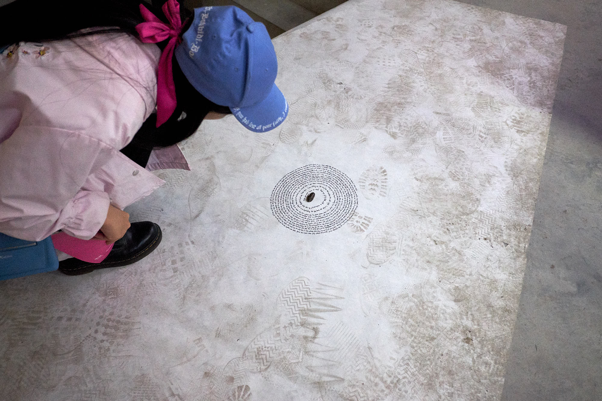

## Sound Installation
Sound installation composed by self recorded audio taken during September through November in Hong Kong. 

