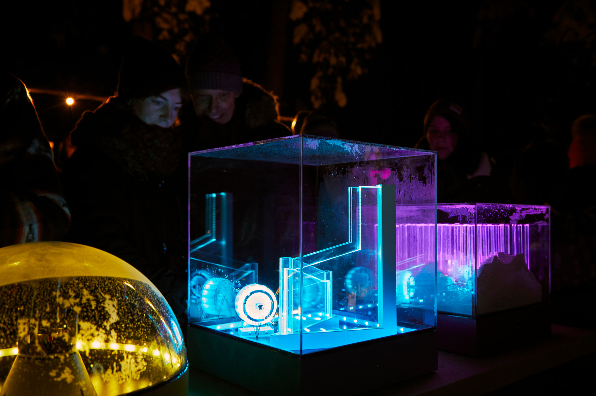
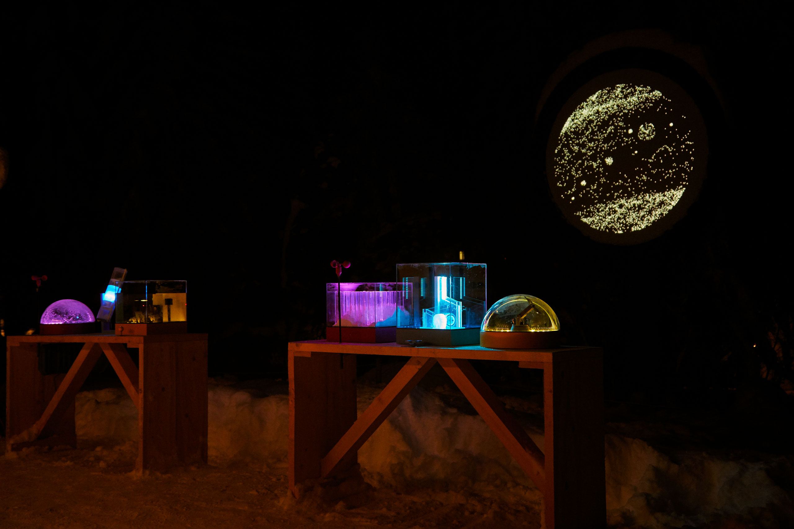

## Exhibited
- Punkt ZHdK Zurich, Switzerland 21–24 April 2019
- Zauberwald Lenzerheide, Switzerland 14–30 December 2018 

## Material
- Acrylic Glass, clear and sandblasted
- MDF
- Arduino
- LED Matrix
- Motor
